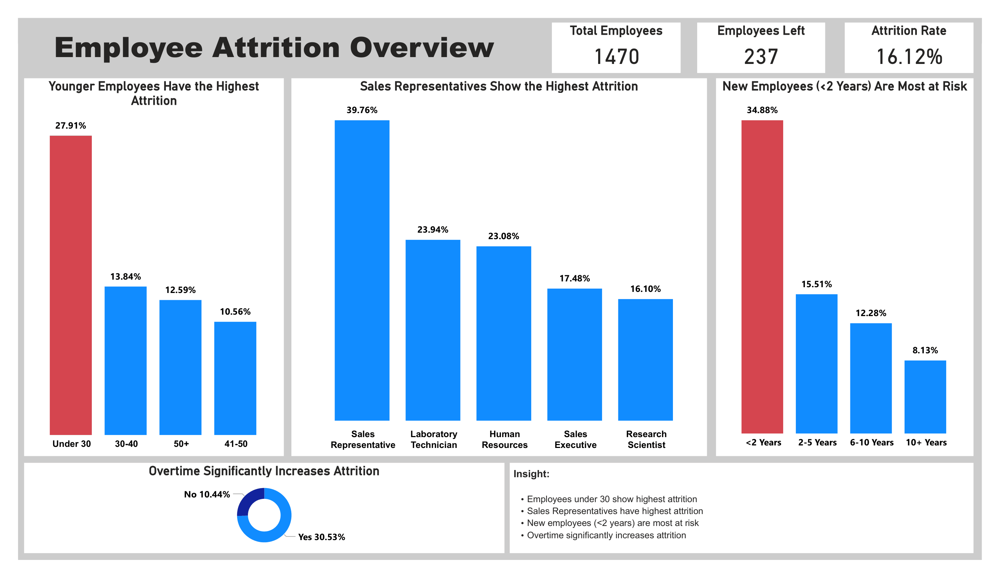
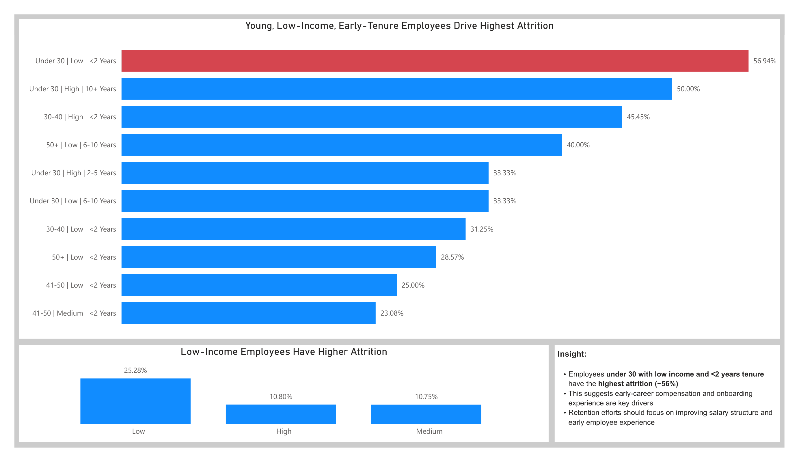
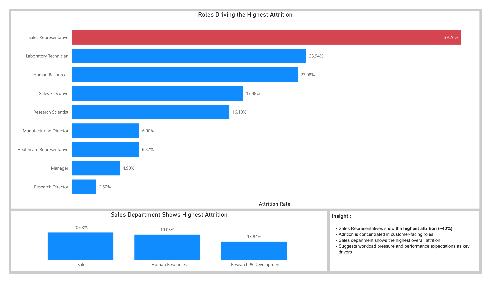
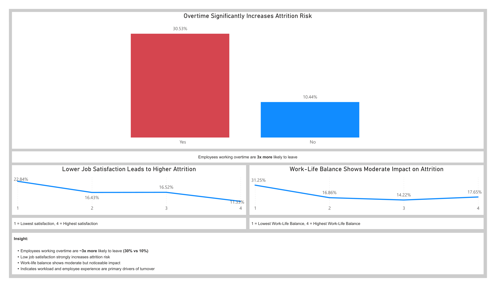

# 📊 HR Attrition Analysis (End-to-End Business Analyst Project)

## 🔍 Project Overview

This project analyzes employee attrition to identify:

* Who is leaving
* Where attrition is concentrated
* Why employees leave

The goal is to provide **data-driven insights and actionable recommendations** to improve employee retention.

---

## 📸 Dashboard Overview

### 🔹 1. Overview Dashboard



### 🔹 2. Who is Leaving



### 🔹 3. Where Are They Leaving



### 🔹 4. Why Employees Leave



---

## 🎯 Business Problem

Employee attrition leads to:

* Increased hiring and training costs
* Loss of productivity
* Reduced team stability

This project aims to uncover the **key drivers of attrition** and help management make informed decisions.

---

## 🧠 Key Insights

* Employees working overtime are **~3x more likely to leave (30% vs 10%)**
* Employees with **low job satisfaction** show significantly higher attrition
* **Early-tenure employees (<2 years)** are the most at risk
* **Younger, low-income employees** have the highest attrition rate
* Attrition is concentrated in **customer-facing roles (e.g., Sales Representatives)**

---

## 💡 Business Recommendations

* Improve workload management to reduce overtime dependency
* Enhance employee experience through better engagement and support
* Strengthen onboarding programs for early-tenure employees
* Review compensation strategy for lower-income segments
* Focus retention strategies on high-risk roles and departments

---

## 🛠 Tools Used

* **Excel** → Data cleaning & preparation
* **Power BI** → Dashboard & visualization

---

## 📊 Dashboard Pages

### 1. Overview

* High-level KPIs (Total Employees, Attrition Rate)
* Summary of key patterns

### 2. Who is Leaving

* Age, income, and tenure segmentation
* Identification of high-risk employee groups

### 3. Where are They Leaving

* Attrition by job role and department
* Identification of high-impact organizational areas

### 4. Why Employees Leave

* Overtime impact (primary driver)
* Job satisfaction and work-life balance analysis

---

## 📁 Project Structure

```
hr-attrition-analysis/
│
├── data/              → Raw dataset
├── excel/             → Data cleaning & analysis
├── dashboard/         → Power BI file
├── images/            → Dashboard screenshots
└── README.md          → Project documentation
```

---

## 🚀 Outcome

This project demonstrates:

* Business problem-solving
* Data-driven decision making
* Segmentation and root cause analysis
* Dashboard design for stakeholders

---

## 📌 Author

**[Your Name]**
Aspiring Business Analyst
